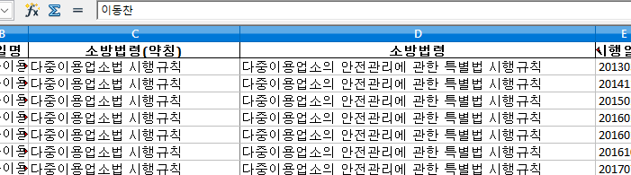
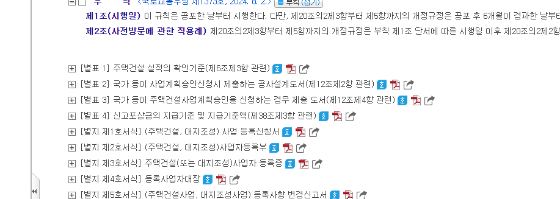

Readme
## 대략적인 코드 로직입니다.

1. 'law_sheet.xlsx'(석승우 매니저님이 보내주신 '작업 리스트' 파일에 각 법령 링크를 G행에 추가한 엑셀파일입니다) 엑셀파일 열기.
2. Selenium으로 G행의 법령 링크 연결하기
3. #conTop > h2 > span 에서 **소방법령 약칭** 정보 받아서

   

  	 3.1. 'updated_law_sheet.xlsx' 엑셀파일의 C행에 입력하기
   
   	3.2. span태그 없는경우 D행 소방법령 내용 복사 붙여넣기

    

4. **소방법령 약칭**명을 토대로 폴더만들어서 법령들 구분하기

	4.1. 약칭의 폴더가 기존에 없는경우 새로 폴더 만들기

	4.2. 있는경우 해당 폴더 사용하기 

	4.3. 엑셀의 B행에서 파일명을 따와서 엑셀파일 생성해서 폴더에 넣어주기

5. #conScroll > ul 에서 별표 리스트 받아오기

    

   	5.1. 별표명 리스트 정보로 '별표'인것만 골라서 엑셀파일에 시트 여러개 만들어주기
	
  		5.1.1. text content 가 '삭제'인 경우 시트 생성 하지말고 넘어가기
	
   		5.1.2. text content 에 '별표'가 아닌경우 (별지 또는 다른경우) 시트 생성 하지말고 넘어가기

   	5.2. '별표'가 하나도 없는 법령같은경우 파일명 앞에 '[별표없음]법령파일.xlsx' 와같이 표시함
	
 	~~5.3. 한글파일 다운받아서 폴더에 넣어주기 -->모든 별표 한글파일 다합하면 480 MB... 여서 하면 안될듯합니다... https://stackoverflow.com/questions/25251583/downloading-file-to-specified-location-with-selenium-and-python~~

6. 첫번째 시트의 첫셀에 G행에 있는 법령 링크 붙여넣기
